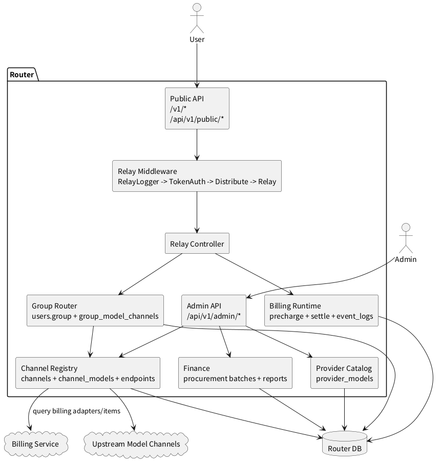
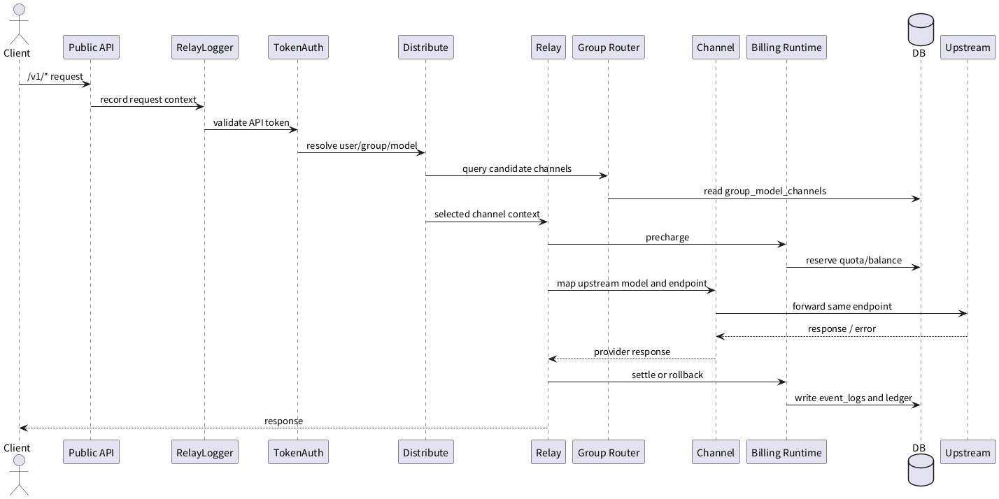
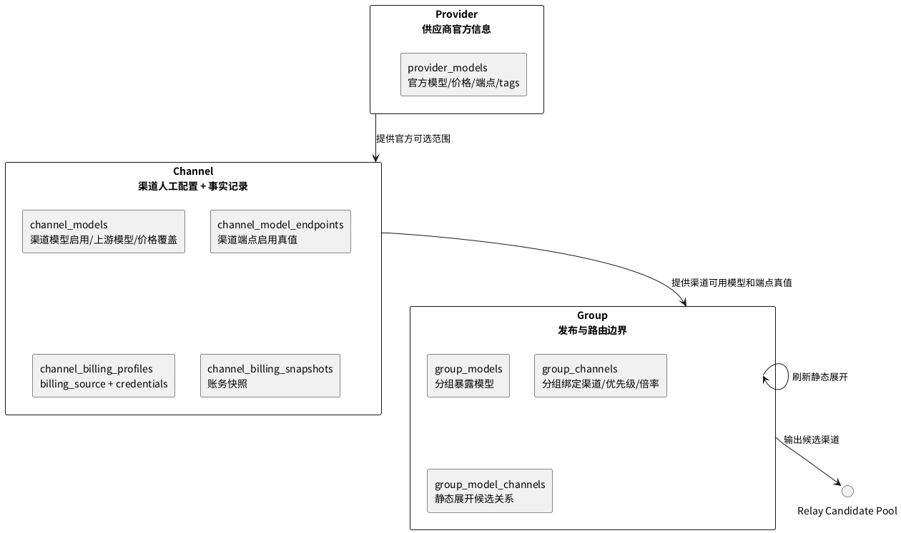
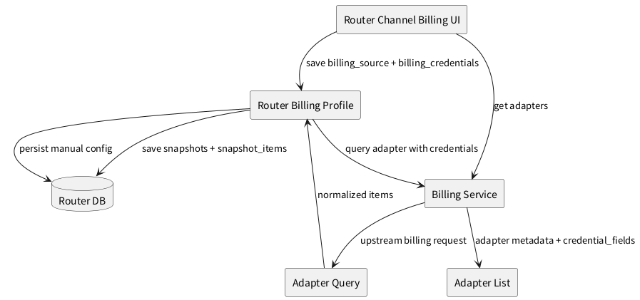

# 路由架构 V1

> 历史归档：本文不代表当前主线入口。当前路由方案见 [../模型路由/模型路由架构.md](../模型路由/模型路由架构.md)。

版本：`2026-08-02`  
状态：当前实现基线

本文档只描述 Router 当前已经落地的路由架构。未实现、需要继续收敛或下一阶段目标统一放入 [路由架构 V2](./路由架构V2.md)，长期路线统一放入 [路由架构 V3](./路由架构V3.md)。

## 1. 产品定位

Router 是面向团队与运营场景的多模型接入、路由治理与商业化平台。它不只是 OpenAI 兼容转发器，还承担模型目录、渠道治理、分组发布、用户权益、请求扣费、财务分析和运营排障。

## 2. 架构总图

## 3. 核心分层

| 层 | 当前职责 | 真值边界 |
| --- | --- | --- |
| 接入层 | 对外提供 OpenAI 兼容接口和用户/管理端 API | 用户模型调用使用 API token；钱包 JWT / UCAN 主要用于登录和用户侧管理接口 |
| 供应商层 | 维护官方模型、官方价格、官方端点和能力标签 | 只表达官方信息，不代表渠道已启用 |
| 渠道层 | 维护渠道接入参数、渠道模型、渠道端点、测试事实和账务配置 | 渠道模型、渠道端点、账务配置由管理员保存；刷新和测试只写事实记录 |
| 分组层 | 维护模型发布范围、渠道绑定、分组渠道倍率和静态展开 | `group_models`、`group_channels` 是人工配置；`group_model_channels` 是静态展开 |
| 路由执行层 | 选路、转发、重试、错误处理和日志落账 | 候选渠道来自 `group_model_channels`，不是运行时临时拼接 |
| 权益扣费层 | 请求准入、预扣、结算、回滚、余额/套餐扣减 | 内部统一记账单位是 YYC |
| 财务层 | 管理收入、采购成本、毛利和毛利率 | 采购成本放在财务下管理，不放在渠道详情里 |

## 4. 请求链路

当前请求内切换规则：

1. 新请求进入时重新选路。
2. 候选渠道按优先级分层，同优先级内随机。
3. 请求内重试由 `system_settings.RetryTimes` 控制。
4. `RetryTimes = 0` 表示关闭请求内切换。
5. 已指定 `SpecificChannelId` 时关闭请求内切换。
6. 文本端点按同端点转发，下游请求端点必须与渠道已启用端点一致。

## 5. 资源治理关系

核心边界：

1. 供应商层只维护官方信息，不能自动启用渠道模型或分组模型。
2. 渠道层拥有渠道模型、渠道端点和账务配置真值。
3. 分组层拥有模型暴露、渠道绑定、优先级和分组渠道倍率。
4. `group_model_channels` 只表达静态展开结果，不能反向改写人工配置。
5. 渠道刷新、端点测试和账务刷新只写事实记录，不静默覆盖管理员配置。

## 6. Billing 服务边界

当前规则：

1. Router 不再内置每个渠道的账务 adapter。
2. Router 只保存 Billing 服务地址、`billing_source` 和 `billing_credentials`。
3. 账务凭据必须手动配置，不回退使用渠道模型请求 API Key。
4. 账务 API 地址、厂商默认地址、凭据字段语义和 adapter 文案由 Billing 服务维护。
5. Billing 服务返回标准权益项，Router 负责保存快照、告警、自动禁用和财务采购记录。

## 7. 财务与计费现状

当前财务链路已经形成三层：

1. 销售层：用户购买套餐、充值、兑换码等 Router 自己的产品。
2. 计价层：按模型价格、usage、倍率和采购成本底线计算用户应扣 YYC。
3. 采购层：记录上游采购成本、采购批次、资源消耗和毛利分析。

当前请求结算并不存在单一“真实 token”口径，至少包括：

1. `returned_usage_final`
2. `hybrid_usage_final`
3. `local_estimate_final`
4. `unit_based_final`
5. `unmetered_proxy`

正式毛利报表必须区分 `actual`、`estimated`、`zero_cost`、`none`。`none` 不代表零成本，不能参与正式毛利率计算。

## 8. 用户与运营边界

1. 用户侧“服务 / 模型”展示平台已发布、可路由模型的服务状态，不按当前用户权益过滤。
2. `/v1/models` 表示当前请求上下文可用模型，继续受 token 范围和用户权益约束。
3. 用户只需要理解套餐和余额，不需要理解后台分组和渠道。
4. 管理端维护供应商、渠道、分组、用户、支付、采购成本、日志和任务。

## 9. 当前架构决策

| 日期 | 决策 | 当前口径 |
| --- | --- | --- |
| 2026-08-02 | Billing 服务边界 | 渠道账务 adapter 下沉到 Billing 服务，Router 只接入统一接口 |
| 2026-08-02 | 财务模块边界 | 一级目录使用“财务”，采购成本统一在财务模块管理 |
| 2026-08-02 | 模型状态可见性 | 模型状态页展示平台服务状态，不按当前用户权益过滤 |

## 10. 关联文档

- [OpenAPI](../接口契约/router.openapi.yaml)
- [路由逻辑](../模型路由/选路决策流程.md)
- [端点协议](../模型路由/端点协议.md)
- [供应商规范](../模型渠道/供应商规范.md)
- [渠道规范](../模型渠道/渠道规范.md)
- [分组规范](../访问控制/分组规范.md)
- [计费架构](../商业计费/计费架构.md)
- [扣费逻辑](../商业计费/扣费逻辑.md)
- [模型计费](../商业计费/模型计费规则.md)
