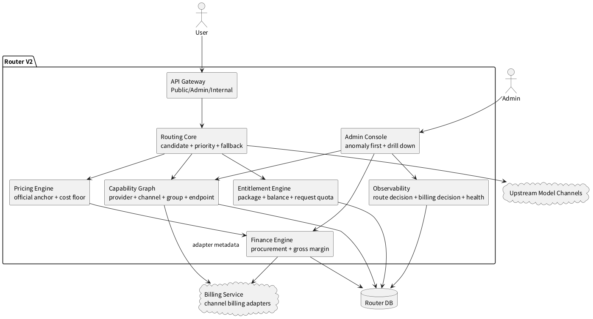
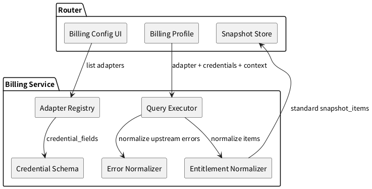

# 路由架构 V2

> 历史归档：本文不代表当前主线入口。当前路由方案见 [../模型路由/模型路由架构.md](../模型路由/模型路由架构.md)。

版本：`2026-08-05`
状态：完成

本文档只记录 Router V2 已经落地的架构事实。当前初始基线见 [路由架构 V1](./路由架构V1.md)，版本之后的内容见 [路由架构 V3](./路由架构V3.md)。

## 1. 版本定位

V2 将 Router 从“可配置转发控制台”推进为“可运营的路由与财务治理系统”。

V2 已落地的边界：

1. 请求路由过程可解释：日志保存初始候选、过滤原因、命中渠道、最终渠道和 fallback 尝试。
2. 模型健康可解释：模型状态区分真实调用、渠道检测和无信号，不再把检测结果误读为调用样本。
3. 财务口径可解释：收入、采购成本、毛利、未配置成本和成本归因状态可以在财务页面下钻。
4. Billing 边界收敛：Router 只接入 Billing 服务，不在 Router 内保留厂商私有账务接口逻辑。
5. 运营入口收敛：路由异常和采购成本异常先以聚合视图展示，再进入日志或采购明细处理。

## 2. 架构图

## 3. 路由解释

V2 在请求日志中写入结构化 `route_decision`：

1. `source`：选路来源，例如自动选路、显式渠道、Responses 会话绑定。
2. `group_id`：请求所在分组。
3. `model`：请求模型。
4. `endpoint`：请求端点。
5. `candidate_channel_ids`：进入本次选择的候选渠道。
6. `filtered_candidates`：进入请求过滤阶段后被排除的渠道和原因码。
7. `selected_priority`：命中渠道优先级。
8. `selection_mode`：选择方式，例如优先级内随机、显式指定。
9. `initial_channel_id` / `initial_channel_name`：初始命中渠道。
10. `final_channel_id` / `final_channel_name`：fallback 后最终渠道。

V2 继续使用结构化 `fallback_attempts` 记录请求内切换：

1. 每次 fallback 的渠道。
2. 每次失败的错误类型、错误码和错误信息。
3. 最终是否切换成功。

运营入口：

1. `运营 / 日志` 顶部展示路由异常概览。
2. 路由异常可按模型、渠道、端点、错误聚合。
3. 聚合项显示失败数、fallback 数、请求数、失败率、最后出现时间和最近错误。
4. 单条日志详情展示 `route_decision`、`fallback_attempts` 和最终错误。

已落地接口：

1. `GET /api/v1/admin/log/route/anomalies`
2. `GET /api/v1/admin/log/:id`

## 4. 模型健康

V2 的模型健康信号分为三类：

1. `traffic`：来自真实调用日志。
2. `probe`：来自渠道检测或健康探测。
3. `none`：当前窗口没有可用信号。

健康展示规则：

1. 有真实调用样本时，优先使用真实调用统计。
2. 没有真实调用但有检测样本时，展示检测结果。
3. 没有任何样本时，展示无信号状态。
4. 普通用户和管理员都能看到可用模型状态；管理员可继续进入渠道、分组和日志排查。

## 5. 财务与采购成本

V2 将请求级采购成本状态收敛为固定枚举：

1. `actual`：已归因到实际采购成本。
2. `estimated`：使用估算采购成本。
3. `pending`：等待归因。
4. `retry`：归因执行失败，等待重试。
5. `unconfigured`：没有可用采购成本配置。
6. `none`：本次请求不产生采购成本。

毛利计算规则：

1. `actual` 和 `none` 进入正式毛利。
2. `estimated` 作为风险参考，不进入正式毛利。
3. `pending`、`retry`、`unconfigured` 不进入正式毛利。
4. 缺失采购成本不按零成本处理。
5. 部分采购成本覆盖不进入正式毛利。

采购成本重试：

1. 主节点后台 worker 定时扫描 `retry` 状态请求。
2. 重试成功后回写采购成本、成本状态、毛利和毛利率。
3. 重试失败后保留 `retry` 状态。
4. 日志记录 `billing_procurement_retry_count`、`billing_procurement_last_retry_at`、`billing_procurement_last_error`。
5. `财务 / 采购成本` 页面展示采购重试队列，并支持人工立即重试。

已落地接口：

1. `GET /api/v1/admin/billing/procurement-report`
2. `GET /api/v1/admin/billing/procurement-trend`
3. `GET /api/v1/admin/billing/procurement/retries`
4. `POST /api/v1/admin/billing/procurement/retries/:id/retry`

## 6. 计价与 Billing 决策

V2 在请求日志中写入版本化 `billing_decision`，当前版本为 `v1`。

`billing_decision` 记录：

1. `version`
2. `stage`
3. `price_unit`
4. `currency`
5. `pricing_source`
6. `usage_source`
7. `settlement_mode`
8. `effective_ratio`
9. `charge_rate`
10. `amount`
11. `charge_amount`
12. `pricing_decision`

计价规则：

1. 用户侧最终扣费使用请求结算后的 `charge_amount`。
2. 销售价由官方锚点、渠道/模型倍率和成本底线共同决定。
3. 采购成本底线触发时，日志记录 `billing_pricing_decision_reason` 和 `billing_cost_floor_triggered`。
4. `billing_effective_ratio` 记录最终生效销售倍率。
5. `billing_group_channel_ratio` 和 `billing_model_channel_ratio` 分别记录分组渠道倍率和模型渠道倍率。

## 7. Billing 服务边界

V2 的 Billing 边界已经收敛为：

1. Router 只配置 Billing 服务地址。
2. Router 不保存渠道账务 API 地址。
3. Router 不展示厂商私有账务文案。
4. Router 不猜测凭据字段含义。
5. Router 不回退使用渠道 API Key 作为账务凭据。
6. Billing 服务提供 adapter 列表、凭据 schema、错误码解释和标准权益项。
7. 每个厂商或渠道的账务 adapter 在 Billing 服务内扩展。

## 8. 文档治理

V2 完成后的文档分层：

1. `docs/README.md`：文档入口。
2. `docs/接口契约/router.openapi.yaml`：接口真源。
3. `docs/历史归档/路由架构V1.md`：当前基础架构事实。
4. `docs/历史归档/路由架构V2.md`：V2 已落地事实。
5. `docs/历史归档/路由架构V3.md`：长期路线和未完成事项。
6. 专题文档保留单一职责，不再用临时方案文档承载重复内容。

## 9. V2 验收结果

V2 验收结果：

1. 任一模型为什么可见、可调用、不可调用，可以从供应商、渠道、分组三层解释。
2. 任一请求为什么命中某渠道、是否 fallback、为什么失败，可以从结构化日志解释。
3. 任一渠道采购成本是否配置、是否参与毛利率，可以在财务报表解释。
4. Billing adapter 扩展只发生在 Billing 服务内，Router 不承载厂商私有账务逻辑。
5. 路由异常和采购成本异常都有聚合入口、明细入口和人工处置入口。

## 10. 非 V2 内容

本文档不记录未落地设计、待办事项或路线内容。相关内容统一维护在 [路由架构 V3](./路由架构V3.md)。
