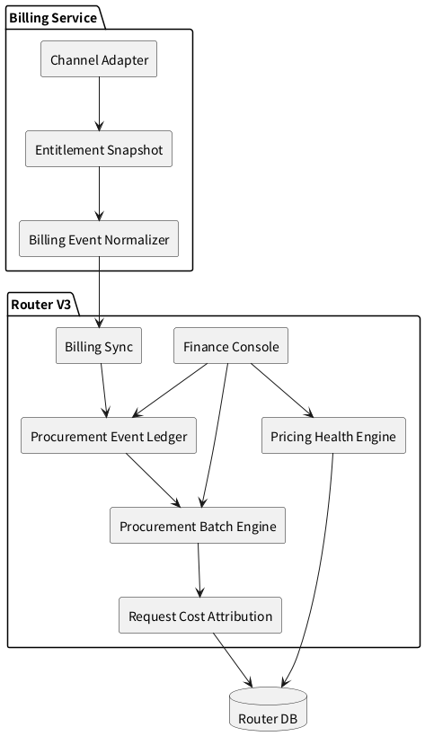

# 路由架构 V3

> 历史归档：本文不代表当前主线入口。当前路由方案见 [../模型路由/模型路由架构.md](../模型路由/模型路由架构.md)。

版本：`2026-08-05`
状态：设计中

当前已完成版本事实见 [路由架构 V2](./路由架构V2.md)。V3 聚焦财务经营能力，不扩散到泛运营系统。

## 1. 版本基调

V3 的核心目标是让 Router 能回答两个经营问题：

1. **渠道采购套餐变化后，真实成本是否被正确记录并反映到请求成本。**
2. **当前卡片定价、分组渠道倍率、模型渠道倍率是否合理。**

V3 不以“展示更多数据”为目标，而是把采购成本和销售定价之间的关系做清楚：

1. 渠道从 Billing 服务同步或手工录入采购套餐事实。
2. 套餐升级、续费、降级、补量、过期等变化形成可审计的采购事件。
3. 采购事件生成或调整采购批次，并参与请求成本归因。
4. 财务页面能判断当前售价和倍率是否覆盖成本、是否达到目标毛利。
5. 系统给出指标和异常标识，帮助运营决定补成本、调倍率、调卡片价格或停用渠道。

## 2. 目标架构



## 3. 渠道 Billing 接入

V3 中，渠道 Billing 接入要支持两类输入：

1. Billing 服务返回的标准权益快照。
2. 管理员手工录入的采购套餐变化。

Router 侧保留的内容：

1. 渠道使用哪个 Billing adapter。
2. 账务凭据 schema 对应的值。
3. Billing 服务返回的标准权益快照。
4. 由快照或手工录入生成的采购事件。
5. 采购事件生成的采购批次。

Router 侧不保留的内容：

1. 厂商私有账务 API 地址。
2. 厂商私有字段含义。
3. 无法解释的原始套餐文案。
4. 渠道 API Key 到账务 Key 的隐式回退。

## 4. 采购事件

V3 将渠道采购变化记录为采购事件。事件是审计真源，采购批次是成本分摊真源。

采购事件类型：

1. `purchase`：新购套餐或额度。
2. `renewal`：续费。
3. `upgrade`：升级套餐。
4. `downgrade`：降级套餐。
5. `quota_adjustment`：补量、扣量或权益修正。
6. `expiry`：过期。
7. `manual_correction`：人工校正。

采购事件字段：

1. 渠道 ID。
2. 事件类型。
3. 事件来源：Billing 服务、手工录入、系统校正。
4. 外部引用 ID。
5. 套餐名称快照。
6. 购买金额、币种、汇率、折算成本。
7. 权益项列表：资源类型、额度类型、总量、剩余量、单位、有效期。
8. 事件发生时间。
9. 操作人和备注。

采购事件处理规则：

1. 新购和续费生成新的采购批次。
2. 升级事件生成增量批次，或关闭旧批次后生成新批次。
3. 降级事件调整后续可用容量，不回写历史请求成本。
4. 补量事件生成或调整批次容量。
5. 过期事件关闭未消耗完的批次。
6. 人工校正必须保留原事件和校正事件，不覆盖审计链路。

## 5. 采购批次与请求成本

采购批次继续作为请求成本归因的分摊单位。

V3 对采购批次补强：

1. 批次必须能追溯到采购事件。
2. 批次记录来源快照和成本计算方式。
3. 批次记录有效容量、已消耗容量、剩余容量。
4. 批次记录单位成本。
5. 批次状态区分可用、停用、耗尽、过期、被校正。

请求成本归因规则：

1. 请求命中渠道后，从该渠道可用采购批次中消耗容量。
2. 请求成本按批次单位成本计算。
3. 请求跨多个批次消耗时，成本按实际消耗加总。
4. 批次不足时，请求成本状态为 `unconfigured` 或 `pending/retry`，不进入正式毛利。
5. 批次变化不重算历史请求，除非管理员执行明确的重算任务。

## 6. 定价合理性指标

V3 要为卡片定价和倍率提供判断指标。指标按“当前价格是否覆盖成本”和“是否达到目标毛利”组织。

核心指标：

1. `sell_price`：当前用户侧销售价格。
2. `effective_ratio`：最终生效倍率。
3. `group_channel_ratio`：分组渠道倍率。
4. `model_channel_ratio`：模型渠道倍率。
5. `procurement_unit_cost`：当前可用采购批次的单位成本。
6. `cost_floor_price`：成本底线价格。
7. `target_margin_price`：目标毛利价格。
8. `actual_margin`：按真实采购成本计算的毛利率。
9. `target_margin_gap`：当前售价与目标毛利价格的差额。
10. `cost_coverage_status`：成本覆盖状态。

成本覆盖状态：

1. `healthy`：售价覆盖成本并达到目标毛利。
2. `low_margin`：售价覆盖成本，但低于目标毛利。
3. `loss`：售价低于采购成本。
4. `unknown_cost`：缺少采购成本，无法判断。
5. `estimated_only`：只有估算成本，判断可信度不足。

## 7. 页面收口

V3 页面不新开大量入口，优先增强现有财务页面。

财务产品职责以 [财务产品说明](../商业计费/财务产品说明.md) 为准：

```text
总览用于判断
利润用于诊断
采购用于治理
```

### 7.1 财务 / 总览

V3 将总览建设为财务治理入口，但不在本版本新增渠道、模型、日期和异常的独立详情路由。

V3 总览研发范围：

1. Header 使用 `财务 / 总览` 面包屑，并明确当前统计范围、基础币种和数据更新时间。
2. 时间范围、渠道和模型筛选同步到 URL，刷新、返回和分享链接不丢失上下文。
3. 展示计费收入、采购成本、毛利、毛利率、成本覆盖率和异常项六个核心指标。
4. 核心指标支持下钻，并携带当前时间、渠道和模型范围。
5. 计费收入、毛利和毛利率下钻到 `财务 / 利润`。
6. 采购成本和成本覆盖率下钻到 `财务 / 采购`。
7. 点击成本覆盖率时，采购页面自动进入未配置成本范围。
8. 渠道毛利使用可扫描表格展示请求数、收入、成本、毛利、毛利率、成本覆盖和异常数。
9. 渠道行可以进入该渠道的利润或采购上下文，不要求用户再次筛选渠道。
10. 异常使用结构化字段展示严重程度、异常类型、影响对象、影响请求数、影响金额和建议动作。
11. Action 根据异常类型区分为查看利润、进入采购、补采购记录、重试归因和查看日志。
12. 从总览进入利润或采购后，面包屑和返回操作必须保留原统计范围。

V3 总览不做：

1. 不在总览直接编辑采购记录。
2. 不在总览展示完整采购批次或请求级成本流水。
3. 不为每种异常建立独立详情页面。
4. 不建设日期级财务详情。
5. 不建设复杂财务图表设计器。
6. 不提供自动价格调整和自动渠道治理。

### 7.2 财务 / 利润

1. 接收总览传入的时间、渠道、模型和分组上下文。
2. 展示模型利润状态、请求数、计费收入、采购成本、毛利、毛利率和成本覆盖。
3. 对低毛利、低于成本、缺成本、待归因、归因失败和仅估算成本给出不同状态。
4. 数据不足必须优先于表面盈利判断。
5. 为异常模型提供查看关联渠道、进入采购和检查价格配置的 Action。
6. 展示卡片价格、渠道倍率、模型倍率和最终售价。
7. 展示当前采购成本、成本底线价格、目标毛利价格。
8. 给出需要检查的渠道、模型、分组和卡片。

### 7.3 财务 / 采购

1. 接收总览或利润传入的时间、渠道、模型、端点和成本范围。
2. 总览层按渠道、模型或端点展示采购成本和成本覆盖。
3. 渠道下钻使用 `财务 / 采购 / 渠道名称` 面包屑。
4. 渠道详情只维护当前渠道的采购记录，不提供误导性的“全部渠道采购记录”。
5. 新增采购记录时，URL、面包屑、表单对象和 API 路径必须指向同一渠道。
6. 保存成功后重新读取服务端采购记录，不依赖本地乐观数据。
7. 成本归因失败记录必须可见、可重试、可审计。
8. 展示采购事件列表和事件生成的采购批次。
9. 支持录入套餐升级、续费、补量、过期和人工校正。
10. 支持从 Billing 服务刷新权益快照并生成采购事件。
11. 展示采购批次对请求成本的消耗情况。

### 7.4 模型 / 渠道

`模型 / 渠道`：

1. 仅保留账务配置和权益状态摘要。
2. 采购事件和批次管理入口跳转到财务页面。
3. 不在渠道详情里重复建设采购分析页面。

## 8. 分阶段实施

### V3.1 采购事件账本

1. 增加采购事件模型和迁移。
2. 手工录入采购事件。
3. 采购事件生成采购批次。
4. 采购批次可追溯到事件。

### V3.2 Billing 快照到采购事件

1. Billing 服务权益快照映射为标准采购事件。
2. 支持识别新增、续费、升级、补量、过期。
3. 保留外部引用 ID，避免重复生成事件。
4. 刷新失败进入可重试状态。

### V3.3 定价合理性指标

1. 计算成本底线价格。
2. 计算目标毛利价格。
3. 计算当前售价与目标价格差异。
4. 输出成本覆盖状态。
5. 在利润页面展示异常和下钻入口。

### V3.4 财务总览下钻闭环

1. 财务筛选条件 URL 化。
2. 核心指标连接利润和采购页面。
3. 渠道毛利改为可下钻表格。
4. 财务异常改为结构化数据和类型化 Action。
5. 利润和采购页面接收并保留总览上下文。
6. 面包屑支持返回原统计范围。
7. 完成总览发现、利润诊断、采购治理、返回验证的闭环。

## 9. 验收标准

V3 完成时必须满足：

1. 渠道套餐升级或续费可以录入，并生成可审计采购事件。
2. 采购事件可以生成或调整采购批次。
3. 请求成本可以追溯到采购批次和采购事件。
4. 财务页面可以判断某卡片、某模型、某渠道倍率是否覆盖成本。
5. 财务页面可以标记亏损、低毛利、缺成本和仅估算成本。
6. Billing 服务刷新导致的权益变化不会覆盖历史审计链路。
7. 缺失采购成本不会被当作零成本。
8. 总览的时间、渠道和模型筛选可以通过 URL 恢复。
9. 总览核心指标能够携带上下文下钻到利润或采购。
10. 异常项能够给出与异常类型匹配的下一步 Action。
11. 渠道采购操作的 URL、面包屑、表单对象和 API 路径保持一致。

## 10. 不做事项

V3 不做：

1. 自动修改用户侧价格。
2. 自动关闭渠道。
3. 自动重算全部历史请求成本。
4. 在 Router 内实现厂商私有 Billing adapter。
5. 把上游套餐直接暴露为用户商品。
