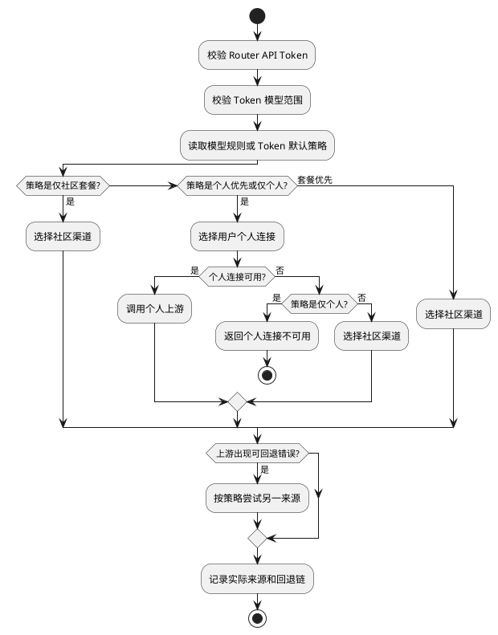

# 个人供应商路由方案

## 目标

Router 给客户端保持一个 Base URL 和一枚 API Token。用户可以在 Router 保存自己的供应商连接；同一请求先按用户策略尝试个人连接，必要时再使用社区套餐的公共渠道。客户端不需要为不同供应商切换 API Key。

本方案解决的是用户自有凭据的接入和混合选路，不是用户向其他用户出售上游容量。

## 产品对象

| 对象 | 用户看到的内容 | 运行职责 |
| --- | --- | --- |
| 我的供应商 | 连接、协议、模型范围、优先级、启停、凭据轮换 | 用户私有上游连接 |
| 我的模型路由 | 某个模型的来源策略 | 覆盖 Token 默认策略 |
| API Token | 模型范围、默认路由策略、请求限额 | 客户端调用凭证 |
| 调用记录 | 实际来源、回退、个人连接名称、社区扣费 | 可追溯性 |
| 个人路由额度 | 本周期个人路由请求数 | 套餐权益计量入口 |

个人连接属于一个 `user_id`，不进入运营侧 `channels`，也不允许被其他用户选择。

## 路由策略

API Token 保存 `route_policy`。用户为某模型设置规则时，模型规则优先于 Token 默认值。

| 值 | 产品名称 | 选择顺序 |
| --- | --- | --- |
| `personal_first` | 个人优先，套餐兜底 | 个人连接，失败后社区渠道 |
| `personal_only` | 仅个人供应商 | 只使用个人连接 |
| `community_only` | 仅社区套餐 | 只使用社区渠道 |
| `community_first` | 套餐优先 | 社区渠道，全部失败后个人连接 |

默认值是 `personal_first`。没有匹配个人连接时，默认策略继续使用社区套餐；`personal_only` 会明确返回没有可用个人连接，绝不扣社区额度。

## 安全边界

1. 密钥仅在创建或轮换请求中接收，任何读取接口只返回 `credential_configured`。
2. 凭据使用 Router 已有必填 `auth.jwt_secret` 派生独立 AES-GCM 密钥加密保存；JWT 回退密钥可用于解密并完成平滑轮换。
3. 请求时才解密；日志、接口响应、错误信息都不输出 API Key。
4. 个人连接只对所属用户的 API Token 生效，管理员的全局指定渠道语义不适用于普通用户。服务端只接受 `openai`、`anthropic`、`gemini`、`ali`、`deepseek` 五种个人文本协议，不能依赖前端下拉框阻止未知协议。
5. 连接删除后不能再被新的请求选中；已有 Responses 会话的后续调用会得到会话上游不可用，而不会切到另一账户。
6. 用户填写的 Base URL 只能是 HTTPS 公有地址，不允许用户信息、查询参数、片段、回环、内网、链路本地、CGNAT 或保留地址。实际转发使用独立 HTTP 客户端，再次解析并直连已校验的公有 IP，且不跟随重定向；它不继承 `RELAY_PROXY`，防止代理端二次解析绕过地址校验。

## 端点和会话边界

第一批只支持文本类兼容端点：`/completions`、`/chat/completions`、`/messages`、`/responses`、`/embeddings`、`/moderations`。

图像、音频、实时连接、视频、文件和异步任务继续使用社区渠道。原因不是协议转换困难，而是这些请求的任务资源和后续查询必须属于同一个上游账户，不能在失败时跨用户凭据转移。

Responses 的 `previous_response_id` 或工具项 ID 已绑定上游时，Router 固定使用原个人连接或原社区渠道；不会因限流、余额不足或策略变更迁移会话。

## 计费和记录

个人来源不扣用户社区余额、YYC 套餐额度或 Token 金额额度；Token 的请求次数限制仍然生效。Token 金额额度在 Router 已选定社区渠道后才校验，因此余额为零的 Token 仍可调用匹配的个人连接，但不能调用社区渠道。调用记录写入：

- `upstream_source`: `personal_provider` 或 `community_package`
- `personal_provider_id`、`personal_provider_name`
- 既有 `route_decision`、`fallback_count`、`fallback_attempts`

个人来源的成功记录将显示“未扣社区套餐”，请求金额和 Router 侧采购成本均为零。个人 API Key 的实际账单只由用户的上游供应商结算；在用户主动提供可验证账单数据前，Router 不推测或展示参考成本。

当前“个人路由额度”先提供本月请求次数统计，`included_requests = 0` 且 `unlimited = true` 表示尚未启用套餐额度闸门。后续把额度作为套餐字段加入现有 `request_quota` 权益模型，不另建用户余额，也不在个人连接中写死费用。

个人供应商参考成本和平台服务费的字段、报价和结算必须在真实收费启用时一起落库；当前不得把推测成本记为用户应付费用。

## OpenRouter 参考

OpenRouter 的 BYOK 采用加密、只写入的用户密钥，并提供用户密钥和共享容量的优先或回退选择。Router 采用相同的产品分层，但不复制其具体费率：

- OpenRouter BYOK: https://openrouter.ai/docs/guides/overview/auth/byok
- OpenRouter 上游选择: https://openrouter.ai/docs/guides/routing/provider-selection

## 第二阶段：社区供给

社区供给不是“我的供应商”的一个开关。它意味着一个用户的上游能力要被其他用户消耗，必须单独建设：

1. 供给协议和供应商准入。
2. 可用容量声明、用户自用保护和熔断。
3. 模型级报价、报价有效期和匹配规则。
4. 风险保证金、异常检测、争议处理和结算。
5. 消费者请求内容保护、数据最小化和审计边界。

在这些能力完成前，任何个人连接都只能为连接所有者服务。
