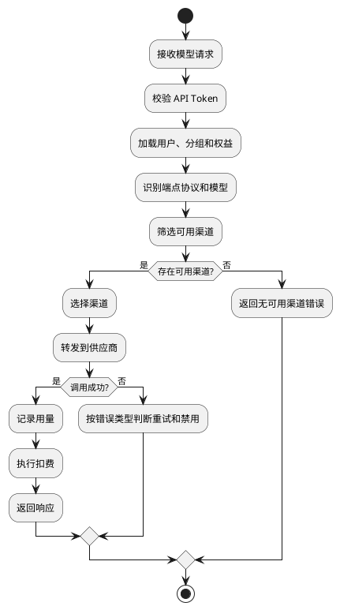

# 模型路由架构

本文描述 Router 当前模型路由主线。历史 V1 / V2 / V3 / V4 文档只保留在 [../历史归档/](../历史归档/) 中，不作为当前入口。

## 主链路

## 模块边界

- 端点协议差异见 [端点协议.md](./端点协议.md)。
- 选路、转发、重试和日志细节见 [选路决策流程.md](./选路决策流程.md)。
- 上游错误分类见 [上游错误处理.md](./上游错误处理.md)。
- 渠道配置见 [../模型渠道/渠道规范.md](../模型渠道/渠道规范.md)。
- 模型兼容策略见 [../模型渠道/模型目录兼容策略.md](../模型渠道/模型目录兼容策略.md)。
- 计费扣费见 [../商业计费/扣费逻辑.md](../商业计费/扣费逻辑.md)。

## 当前原则

1. Router 不做跨端点协议的隐式转换。
2. 下游请求什么端点协议，Router 就按该端点协议处理。
3. 供应商 adaptor 只处理供应商特有差异，不改变请求的计费语义。
4. 渠道可用性、模型能力、分组暴露和计费规则需要分别建模。
