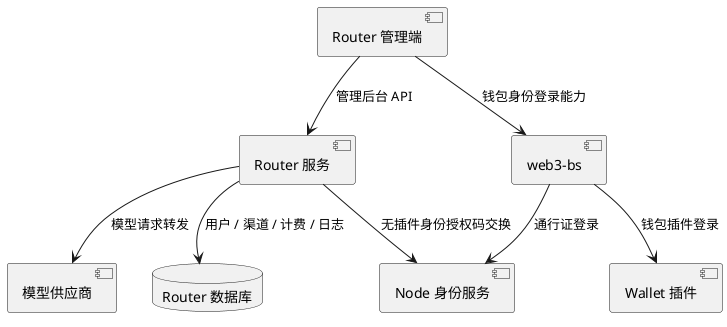

# 系统概览

Router 是夜莺社区的模型访问和运营治理服务，提供 OpenAI 兼容入口、管理后台、渠道治理、模型路由、用户权益、计费扣费和财务分析能力。

Router 位于 Web3 应用层。它消费 Wallet、Node 和 web3-bs 提供的钱包身份能力，但不负责创建钱包身份、注册通行证或管理认证器。

## 系统位置

## 核心链路

1. 用户通过钱包插件或通行证登录 Router 管理端。
2. Router 以钱包身份 DID 识别外部身份，并创建或复用本地用户。
3. 用户创建 API Token 后，从 OpenAI 兼容端点发起模型请求。
4. Router 校验 Token、加载用户权益、选择渠道并转发到供应商。
5. 请求完成后，Router 记录日志、计算用量、执行扣费并沉淀财务数据。

## 文档入口

- 身份登录见 [../身份登录/钱包身份登录方案.md](../身份登录/钱包身份登录方案.md)。
- 模型路由见 [../模型路由/模型路由架构.md](../模型路由/模型路由架构.md)。
- 模型渠道见 [../模型渠道/渠道规范.md](../模型渠道/渠道规范.md)。
- 商业计费见 [../商业计费/计费架构.md](../商业计费/计费架构.md)。
- 部署运维见 [../部署运维/部署手册.md](../部署运维/部署手册.md)。
