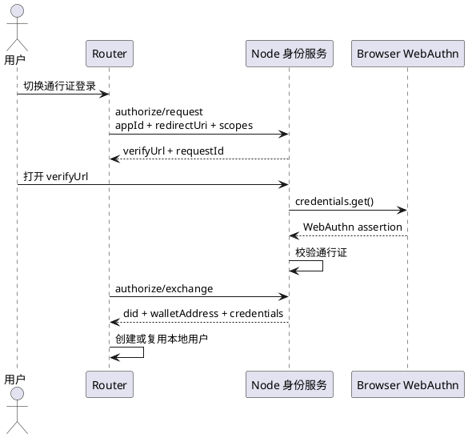

# 通行证登录方案

通行证登录用于没有钱包插件的场景。用户通过 Node 身份服务完成认证，Router 通过授权码 exchange 获取钱包身份 DID、钱包地址和已授权身份凭证。

## 目标

1. 用户无需安装钱包插件，也可以登录 Router。
2. 登录结果仍然收敛到钱包身份 DID。
3. 通行证只是钱包身份认证器，不是新的身份主体。
4. Router 不注册、查看或撤销通行证。

## 流程

## 配置要求

Router 必须配置：

- `identity.node_url`
- `identity.app_id`

`identity.app_id` 是 Node 应用中心里的 Router 应用标识，用于校验 `redirectUri` 和授权边界。钱包插件登录不依赖该配置。

## 常见问题

无法连接夜莺身份服务：

检查 `identity.node_url` 是否可访问，Node 身份服务是否启动。

页面不存在：

检查 Node 是否提供 `/identity/authorize` 页面，或者本地访问地址是否指向了错误服务。

Router 钱包身份登录尚未配置：

说明当前使用的是无钱包插件通行证登录路径，需要配置 `identity.node_url` 和 `identity.app_id`。
